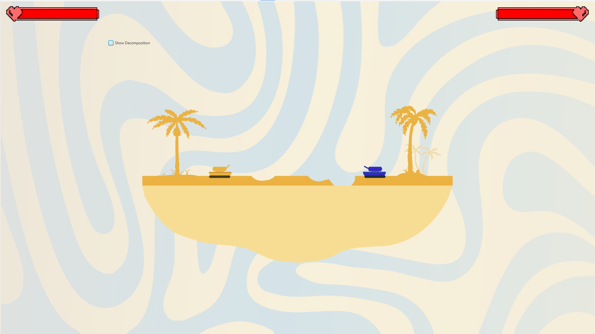
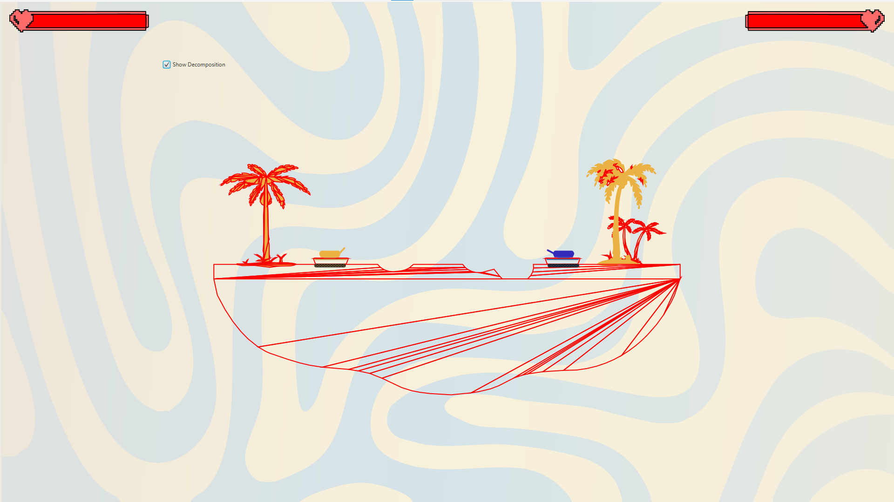
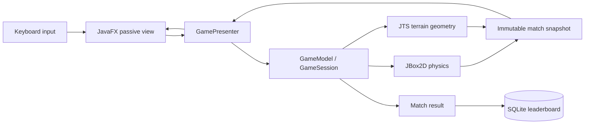

<div align="center">


# Angry Tanks

**A technical Java project combining SVG-driven assets, JBox2D physics, JTS polygon processing, and passive-view MVP.**

A local two-player artillery game inspired by *Worms* and *Scorched Earth*, with destructible terrain and offline SQLite persistence.

<p>
  
  
  
  
</p>

[Getting Started](#getting-started) · [Architecture](#architecture) · [Technical Pipeline](#technical-pipeline) · [Report a Bug](https://github.com/fabiodinota/angry-tanks/issues/new)

</div>

## Tank Roster

<table>
  <tr>
    <td align="center"><br><sub>Yellow</sub></td>
    <td align="center"><br><sub>Blue</sub></td>
    <td align="center"><br><sub>Red</sub></td>
    <td align="center"><br><sub>Green</sub></td>
    <td align="center"><br><sub>Purple</sub></td>
    <td align="center"><br><sub>BMW</sub></td>
    <td align="center"><br><sub>Cyan</sub></td>
    <td align="center"><br><sub>Pink</sub></td>
    <td align="center"><br><sub>Dark Red</sub></td>
  </tr>
</table>

## Gameplay Preview

<table>
  <tr>
    <th width="50%">Normal terrain</th>
    <th width="50%">Decomposition overlay</th>
  </tr>
  <tr>
    <td></td>
    <td></td>
  </tr>
</table>

## Features

| | |
|---|---|
| **Physics-based artillery** | Aim and fire projectiles simulated by JBox2D. Multiple shells can remain in flight at once. |
| **Destructible terrain** | Impacts carve craters into polygon terrain, then rebuild validated collision fixtures. |
| **Local two-player matches** | Choose from nine tank designs, enter player names, and take turns on one computer. |
| **Persistent leaderboard** | Match results update a local SQLite database automatically; PostgreSQL is available as an optional adapter. |
| **Debug visualization** | Toggle decomposition outlines to inspect the convex polygons used by the physics engine. |
| **Fullscreen pixel-art interface** | Five JavaFX screens cover the menu, tank selection, gameplay, results, and leaderboard. |

## How It Works

Angry Tanks uses passive-view Model–View–Presenter. JavaFX views translate input and render immutable frames; presenters coordinate screen and match lifecycles; the model owns all gameplay, physics, and terrain state.



Each frame advances the physics world, applies deferred collision effects after the world unlocks, synchronizes model state, and publishes a snapshot for rendering. Views never mutate simulation objects directly.

### Architecture

| Area | Responsibility |
|---|---|
| `model` | Match rules, turns, entities, JBox2D physics, terrain geometry, and immutable snapshots |
| `presenter` | Input coordination, frame delivery, navigation requests, and lifecycle cleanup |
| `view` | JavaFX screens, HUD, renderers, input translation, and runtime timing adapters |
| `infrastructure` | SVG asset loading plus SQLite and PostgreSQL persistence adapters |
| `app` | Dependency construction, FXML loading, scene navigation, and match creation |

## Tech Stack

| Purpose | Technology |
|---|---|
| Language and runtime | Java 22 |
| Desktop UI | JavaFX 22.0.1 and FXML |
| Physics | JBox2D 2.2.1.1 |
| Geometry | JTS 1.18.2 plus custom polygon simplification, ear clipping, and convex merging |
| Local persistence | SQLite through Xerial SQLite JDBC 3.53.4.0 |
| Optional persistence | PostgreSQL JDBC 42.7.5 |
| Build | Maven Wrapper |

## Getting Started

### Prerequisites

- JDK 22 with `JAVA_HOME` configured
- A graphical desktop session for running the game

Maven is provided through the repository wrapper, so a separate Maven installation is not required.

### Install and run

```bash
git clone https://github.com/fabiodinota/angry-tanks.git
cd angry-tanks
```

On Windows PowerShell:

```powershell
.\mvnw.cmd javafx:run
```

On macOS or Linux:

```bash
./mvnw javafx:run
```

The default configuration creates `data/angrytanks.db` and its `users` table on first use. No database server or manual setup is needed.

## Playing

Choose **Play**, select two different tanks, enter both player names, and start the match.

| Key | Action |
|---|---|
| `A` / `D` | Move the current tank left or right |
| `W` / `S` | Aim the cannon up or down |
| `G` | Fire once and immediately pass the turn |

Each tank starts with 100 health. An opposing shell hit deals 25 damage. Firing has a 60-step cooldown, and holding `G` does not create repeated shots. The **Show Decomposition** option displays the polygons used for rendering and collision fixtures.

## Leaderboard Configuration

SQLite is the default offline store. A completed match gives the winner one win and 100 score, while the loser receives one loss. Usernames are matched case-insensitively while preserving their original spelling.

| Environment variable | Default |
|---|---|
| `ANGRY_TANKS_DB_MODE` | `sqlite` |
| `ANGRY_TANKS_DB_PATH` | `data/angrytanks.db` |

If persistence is unavailable, gameplay continues and the leaderboard displays an error row.

<details>
<summary><strong>Optional PostgreSQL configuration</strong></summary>

PostgreSQL is used only when `ANGRY_TANKS_DB_MODE=postgres`. The application expects an existing database and does not create or import one.

| Environment variable | Default |
|---|---|
| `ANGRY_TANKS_DB_URL` | `jdbc:postgresql://localhost:8080/angrytanks` |
| `ANGRY_TANKS_DB_USER` | `postgres` |
| `ANGRY_TANKS_DB_PASSWORD` | Empty |

Enable the optional JDBC driver with the Maven profile:

```powershell
$env:ANGRY_TANKS_DB_MODE = "postgres"
$env:ANGRY_TANKS_DB_PASSWORD = "your-password"
.\mvnw.cmd -Ppostgres javafx:run
```

</details>

## Project Structure

```text
src/main/
├── java/com/angrytanks/
│   ├── app/             # Composition, navigation, and match creation
│   ├── model/           # Gameplay, physics, geometry, and snapshots
│   ├── presenter/       # MVP presenters and presentation contracts
│   ├── view/            # JavaFX-free view contracts and JavaFX views
│   └── infrastructure/  # SVG loading and database adapters
└── resources/           # FXML, CSS, maps, tanks, images, and fonts
```

## Technical Pipeline

### SVG map loading

Maps are stored as SVG resources. `SvgAssetLoader` reads each document with the JDK XML parser, extracts the root `background` attribute, resolves class-based fill colors, and converts supported `path`, `polygon`, `polyline`, and `rect` elements into plain coordinate data.

`MapLayout` assigns behavior from each element ID:

| ID contains | Created object |
|---|---|
| `ground` | Landscape terrain |
| `grass` | Destructible grass terrain |
| `sand` | Destructible sand terrain |
| `decor` | Non-physical decoration |

The same SVG pipeline loads tank hulls, turrets, cannons, pivots, colors, and decorative parts.

### Polygon and physics conversion

Imported polygons are normalized and validated before entering JBox2D. Concave shapes pass through the custom simplification, ear-clipping, and convex-merging pipeline. Shapes with holes use the existing JTS triangulation fallback. Every final fixture is convex and contains between three and eight vertices, matching JBox2D's polygon limits.

```text
SVG shape → coordinate ring → validated polygon → convex parts → JBox2D fixtures
```

### Projectiles and crater creation

Firing creates a projectile at the cannon tip and applies a JBox2D impulse using the cannon's current angle. The contact listener accepts the projectile's first valid tank or terrain collision, records the impact position, and defers the mutation until the physics world is unlocked.

```text
Projectile impact
├── Tank    → remove shell → apply 25 damage → finish match at zero health
└── Terrain → remove shell → subtract an ellipse → decompose geometry → rebuild fixtures
```

Terrain damage is transactional. The crater is subtracted with JTS, then the new polygon parts, render snapshot, and physics fixtures are prepared before replacing the live terrain. If reconstruction fails, the previous terrain geometry and collision body remain active.

### Frame rendering

After each physics step, `GameSession` publishes an immutable match snapshot. `GamePresenter` wraps it in a display frame, and the JavaFX renderers update retained nodes by entity ID. Enabling **Show Decomposition** changes only the overlay; it does not mutate the physics model.

## Contributing

Bug reports and focused improvements are welcome through [GitHub Issues](https://github.com/fabiodinota/angry-tanks/issues). For code changes:

1. Create a branch for one focused change.
2. Preserve existing gameplay and numerical behavior unless the issue explicitly describes a correction.
3. Run `mvnw package` before opening a pull request.
4. Document behavior changes involving physics, terrain, turns, or persistence.
